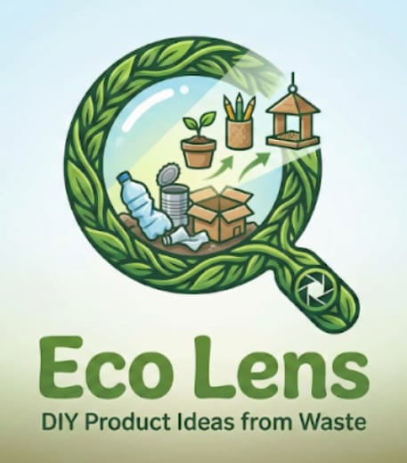
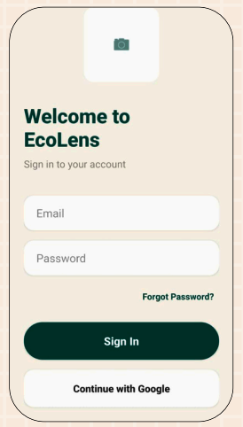
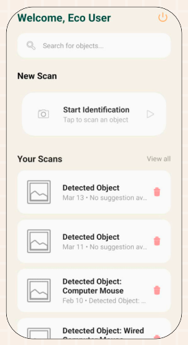
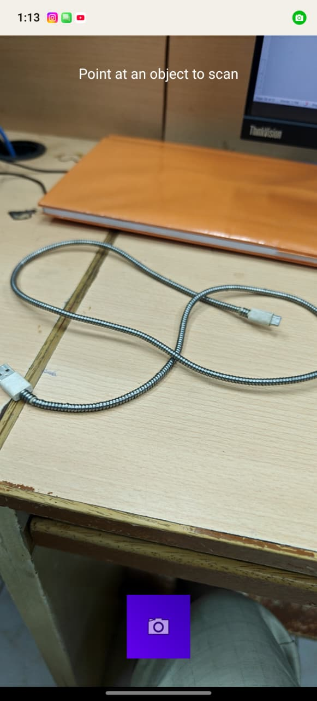
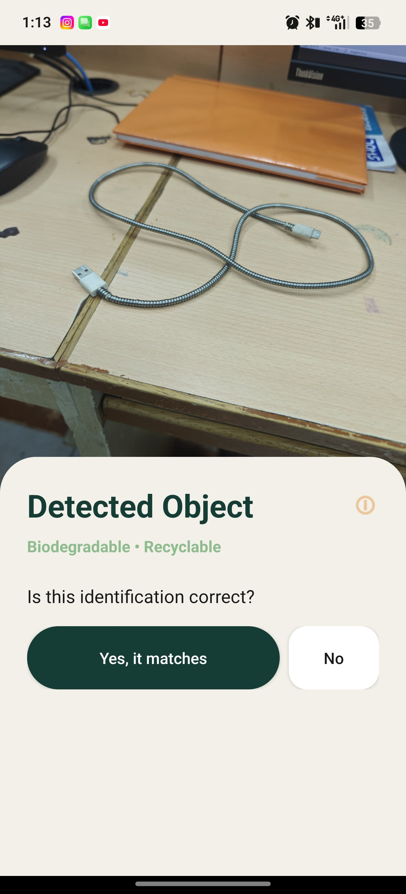
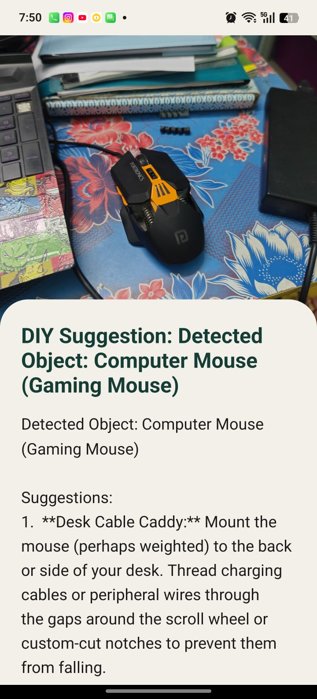
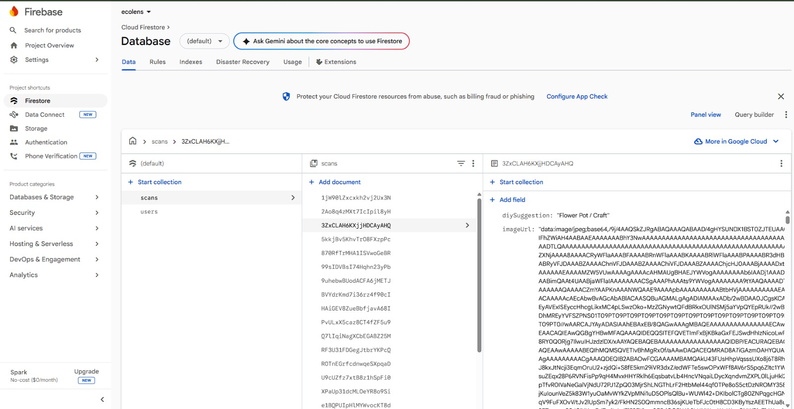

# 🌿 EcoLens — Real-Time Waste Material Recognition & AI Smart DIY Suggestion System

<p align="center">
  
  
  
  
  
</p>

<p align="center">
  <strong>Scan. Identify. Create.</strong><br/>
  A mobile app that identifies waste materials in real-time using AI and suggests creative DIY upcycling ideas — turning trash into treasure.
</p>

---

## 📖 Abstract

EcoLens is a mobile-based intelligent system that identifies waste materials using AI-powered image recognition. The app captures real-time images through the smartphone camera, processes them using the **Google Gemini 2.5 Flash API**, and delivers context-aware DIY upcycling suggestions. All scan results and user history are stored securely in **Firebase Firestore**, making the system practical, scalable, and eco-conscious.

---

## 🚨 Problem Statement

Traditional waste management follows a linear **take → make → dispose** model with major limitations:

| Limitation | Description |
|---|---|
| ❌ Recognition Gap | Cannot identify unlabelled or modified objects |
| ❌ User Dependency | Highly dependent on individual knowledge for sorting |
| ❌ High Error Rate | Manual sorting leads to frequent recycling mistakes |
| ❌ No Creative Reuse | No support for DIY or upcycling solutions |

---

## ✅ Proposed Solution

EcoLens addresses all these gaps with:

- 🤖 **AI-based image recognition** instead of manual identification
- 📷 **Real-time waste detection** using the device camera
- 💡 **AI-generated DIY suggestions** tailored to the detected material
- ☁️ **Firebase** for secure cloud storage
- 📱 Clean, **user-friendly mobile interface**

---

## ✨ Features

- 🔐 **Google & Email Authentication** via Firebase Auth
- 📸 **Real-time Camera Scanning** — point and detect
- 🧠 **AI-Powered Identification** using Gemini 2.5 Flash
- ♻️ **3 DIY Suggestions** generated per scan
- 🗂️ **Scan History** — view and manage past scans
- 🔒 **Encrypted Data Storage** in Firebase Firestore
- ✅ **Confirmation Step** — verify detection before AI processing

---

## 🏗️ System Architecture

```
User → Camera Capture → Image Preprocessing (Base64)
     → Gemini 2.5 Flash API → AI Inference
     → DIY Suggestions → Firebase Firestore (Auto-Save)
     → History Module (Retrieval)
```

### Workflow

| Step | Module | Description |
|------|--------|-------------|
| 0 | App Loader | Splash screen / initialization |
| 1 | Authentication | Login or register (Email / Google) |
| 2 | Dashboard | View recent scans, start new scan |
| 3 | Camera Capture | Point camera at waste object |
| 4 | Confirmation | Verify the detected object |
| 5 | AI Analysis | Gemini API processes the image |
| 6 | DIY Suggestions | 3 creative reuse ideas displayed |
| 7 | Auto-Save | Result stored encrypted in Firestore |

---

## 🧩 Modules

| Module | Functionality |
|--------|---------------|
| **Authentication** | Secure login & registration via Firebase Auth |
| **Image Acquisition** | Captures real-time images using device camera |
| **AI Processing** | Sends image to Gemini API for object identification |
| **Suggestion** | Generates contextual DIY reuse ideas for recyclable materials |
| **Data Management** | Stores scan results & user data securely in Firestore |
| **History** | Retrieves and displays previously scanned items |

---

## 🔬 Algorithm

1. **Input Acquisition** — Capture image using the camera
2. **Preprocessing** — Compress and convert to Base64 for API transmission
3. **AI Inference** — Send to Gemini API for object identification and suggestion generation
4. **Response Processing** — Extract and format AI results for display
5. **Data Storage & Retrieval** — Store in Firebase; retrieve user history on demand

---

## ⚙️ System Specifications

### Hardware Requirements

| Component | Requirement |
|-----------|-------------|
| Processor | Min. 2.0 GHz Octa-core |
| RAM | 4 GB (Min), 6 GB recommended |
| Camera | 12 MP or higher |
| Storage | Min. 100 MB free space |
| Internet | Required |

### Software Stack

| Component | Technology |
|-----------|------------|
| OS | Android 8.0 (Oreo) or above |
| Language | Kotlin |
| IDE | Android Studio |
| Backend | Firebase Firestore & Authentication |
| AI Integration | Google Gemini 2.5 Flash API |

---

## 🚀 Getting Started

### Prerequisites

- Android Studio (latest stable)
- Android device or emulator running Android 8.0+
- Google Firebase project set up
- Google Gemini API key

### Setup

1. **Clone the repository**
   ```bash
   git clone https://github.com/your-username/ecolens.git
   cd ecolens
   ```

2. **Open in Android Studio**
   - Open Android Studio → `Open an existing project` → select the `ecolens` folder

3. **Configure Firebase**
   - Go to [Firebase Console](https://console.firebase.google.com/) and create a project
   - Add your Android app (use your package name)
   - Download `google-services.json` and place it in the `app/` directory
   - Enable **Authentication** (Email/Password + Google Sign-In)
   - Enable **Cloud Firestore**

4. **Add Gemini API Key**
   - Get your API key from [Google AI Studio](https://aistudio.google.com/)
   - Add it to your `local.properties` or `BuildConfig`:
     ```
     GEMINI_API_KEY=your_api_key_here
     ```

5. **Build and Run**
   ```bash
   ./gradlew assembleDebug
   ```
   Or press **Run ▶** in Android Studio.

---

## 📱 Screenshots

<p align="center">
  <br/>
  <em>App Logo</em>
</p>

<p align="center">
  
  &nbsp;&nbsp;
  
  &nbsp;&nbsp;
  
</p>
<p align="center">
  <em>Login / Register &nbsp;&nbsp;&nbsp;&nbsp;&nbsp;&nbsp;&nbsp;&nbsp;&nbsp;&nbsp;&nbsp;&nbsp;&nbsp; Dashboard &nbsp;&nbsp;&nbsp;&nbsp;&nbsp;&nbsp;&nbsp;&nbsp;&nbsp;&nbsp;&nbsp;&nbsp;&nbsp; Camera Scan</em>
</p>

<p align="center">
  
  &nbsp;&nbsp;
  
  &nbsp;&nbsp;
  
</p>
<p align="center">
  <em>Detection Confirmation &nbsp;&nbsp;&nbsp;&nbsp;&nbsp; DIY Suggestions &nbsp;&nbsp;&nbsp;&nbsp;&nbsp; Firebase Encrypted</em>
</p>

---

## 🔮 Future Enhancements

- 📡 **Offline AI Model** — Basic waste detection without internet using on-device ML models
- 🕶️ **Augmented Reality (AR) Guidance** — Step-by-step DIY instructions overlaid via AR
- 🎙️ **Voice-Based Interaction** — Hands-free scanning and navigation via voice commands
- 🌐 **Multi-Language Support** — Localization for improved accessibility (Tamil, Hindi, and more)
- 🧬 **Personalized Recommendation Engine** — DIY suggestions based on user history and preferences

---

<p align="center">
  Made with 💚 for a greener planet &nbsp;|&nbsp; EcoLens — <em>Scan. Identify. Create.</em>
</p>
